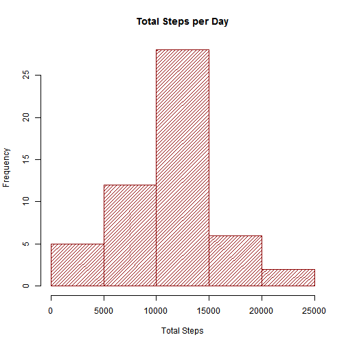
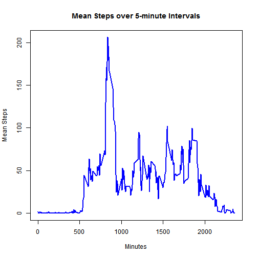
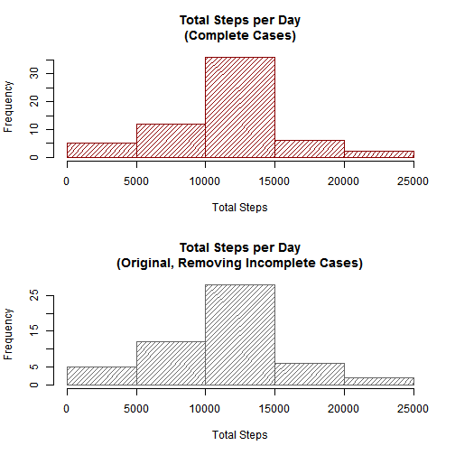
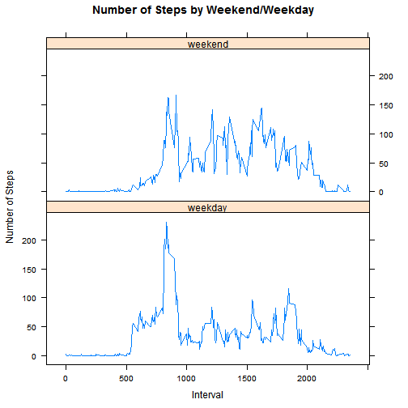

# Human Activity Data Analysis
This assignment makes use of data from a personal activity monitoring device. This device collects data at 5 minute intervals throughout the day. The data consists of two months of data from an anonymous individual collected during the months of October and November, 2012 and include the number of steps taken in 5 minute intervals each day.

***************************************

## A. Loading and preprocessing the data
### A.1. Load necessary libraries and use the right proxy

```r
setInternet2(use=TRUE)
require(dplyr)
```

```
## Loading required package: dplyr
## 
## Attaching package: 'dplyr'
## 
## The following objects are masked from 'package:stats':
## 
##     filter, lag
## 
## The following objects are masked from 'package:base':
## 
##     intersect, setdiff, setequal, union
```

```r
require(xtable)
```

```
## Loading required package: xtable
```

```r
require(lubridate)
```

```
## Loading required package: lubridate
```

```r
require(ggplot2)
```

```
## Loading required package: ggplot2
```

```r
require(lattice)
```

```
## Loading required package: lattice
```

### A.2. Download and unzip the data
If we do not already have the ZIP file, download it and unzip it.  We teach
the computer how to get the data, instead of downloading it manually with
the browser.

```r
URL <- "https://d396qusza40orc.cloudfront.net/repdata%2Fdata%2Factivity.zip"
if (!file.exists("activity.zip")) {
        download.file(URL, destfile="./activity.zip", method="internal",
                      mode="wb")
        unzip(zipfile="./activity.zip")
}
```
### A.3. Read the CSV file.  

```r
activity.raw <- read.csv(file="./activity.csv")
# Convert to local table and remove NA steps  
activity <- tbl_df(activity.raw) %>% filter(!is.na(steps))
# Let's see a few rows of the data
print(xtable(head(activity)), type="html")
```

<!-- html table generated in R 3.2.1 by xtable 1.7-4 package -->
<!-- Fri Aug 07 12:27:49 2015 -->
<table border=1>
<tr> <th>  </th> <th> steps </th> <th> date </th> <th> interval </th>  </tr>
  <tr> <td align="right"> 1 </td> <td align="right">   0 </td> <td> 2012-10-02 </td> <td align="right">   0 </td> </tr>
  <tr> <td align="right"> 2 </td> <td align="right">   0 </td> <td> 2012-10-02 </td> <td align="right">   5 </td> </tr>
  <tr> <td align="right"> 3 </td> <td align="right">   0 </td> <td> 2012-10-02 </td> <td align="right">  10 </td> </tr>
  <tr> <td align="right"> 4 </td> <td align="right">   0 </td> <td> 2012-10-02 </td> <td align="right">  15 </td> </tr>
  <tr> <td align="right"> 5 </td> <td align="right">   0 </td> <td> 2012-10-02 </td> <td align="right">  20 </td> </tr>
  <tr> <td align="right"> 6 </td> <td align="right">   0 </td> <td> 2012-10-02 </td> <td align="right">  25 </td> </tr>
   </table>

***************************************

## B. What is mean total number of steps taken per day?
### B.1. Total Steps per day
Calculate the total number of steps taken per day

```r
# Use `dplyr` to group the data by day, and then summarize it
daily.steps <- activity %>%
        group_by(date) %>%
        summarize(steps.sum=sum(steps))
```

### B.2. Histogram: Steps per day
Make a histogram of the total number of steps taken each day

```r
hist(daily.steps$steps.sum, main="Total Steps per Day", xlab="Total Steps",
     ylab="Frequency", col="dark red", density=20)
```

 

### B.3. Report median and mean
Calculate and report the mean and median of the total number of steps taken
per day

```r
mean(daily.steps$steps.sum)
```

```
## [1] 10766.19
```

```r
median(daily.steps$steps.sum)
```

```
## [1] 10765
```

***************************************

## C. What is the average daily activity pattern?
### C.1. Time Series: steps per interval
Make a time series plot (i.e. type = "l") of the 5-minute interval (x-axis) 
and the average number of steps taken, averaged across all days (y-axis)

```r
steps.ts <- activity %>% group_by(interval) %>% summarize(mean.steps=mean(steps))
plot(steps.ts, type="l", col="blue", lwd=2, 
     main="Mean Steps over 5-minute Intervals", xlab="Minutes", 
     ylab="Mean Steps")
```

 

### C.2. Most Active Interval?
Which 5-minute interval, on average across all the days in the dataset, contains the maximum number of steps?

```r
max.interval <- steps.ts[which.max(steps.ts$mean.steps),]
```
The 5-minute interval, **835**, on average across all the days in the dataset, contains the maximum number of steps (**206.1698113**) steps.

***************************************

## D. Imputing missing values
Note that there are a number of days/intervals where there are missing values (coded as NA). The presence of missing days may introduce bias into some calculations or summaries of the data.

### D.1. Number of Missing Step Values?
Calculate and report the total number of missing values in the dataset 
(i.e. the total number of rows with NAs)

```r
sum(is.na(activity.raw$steps))
```

```
## [1] 2304
```

### D.2. Impute Values from Mean Steps per Interval
Devise a strategy for filling in all of the missing values in the dataset. The
strategy does not need to be sophisticated. For example, you could use the
mean/median for that day, or the mean for that 5-minute interval, etc.

```r
# Find both incomplete and complete cases
missing.activity <- tbl_df(activity.raw) %>% filter(is.na(steps))
complete.activity <- tbl_df(activity.raw) %>% filter(!is.na(steps))

# Impute the missing values from the 5-minute averages calculated earlier
imputed.missing <- left_join(missing.activity, steps.ts) %>%
        select (steps=mean.steps, date, interval)
```

```
## Joining by: "interval"
```

### D.3. Create Complete Cases
Create a new dataset that is equal to the original dataset but with the missing
data filled in.

```r
# Complete the dataset by rbinding the imputed values with the 
# complete cases; sort by date and interval again.
whole.activites <- rbind(imputed.missing, complete.activity) %>% arrange(date,interval)
```

### D.4. Effect of Imputation?
Make a histogram of the total number of steps taken each day and Calculate and
report the mean and median total number of steps taken per day. Do these values
differ from the estimates from the first part of the assignment? 

What is the impact of imputing missing data on the estimates of the total
daily number of steps?

*The effect of imputing the the missin daily number of steps from 5-minute
intervals is to bring the `mean` and `median` closer together.*

```r
# Use `dplyr` to group the data by day, and then summarize it
daily.complete.steps <- whole.activites %>%
        group_by(date) %>%
        summarize(steps.sum=sum(steps))

# Plot the new and old histograms to see the effect of 
# imputing missing values
par(mfrow=c(2,1))

hist(daily.complete.steps$steps.sum, 
     main="Total Steps per Day\n(Complete Cases)", xlab="Total Steps",
     ylab="Frequency", col="dark red", density=20)

hist(daily.steps$steps.sum, 
     main="Total Steps per Day\n(Original, Removing Incomplete Cases)",
     xlab="Total Steps", ylab="Frequency", col="gray40", density=20)
```

 

```r
# Create a small table to show how imputing values affects the mean
# and median of total daily steps.
res <- with(daily.steps, 
        data.frame(Mean=mean(steps.sum),
                          Median=median(steps.sum),
                          Difference=mean(steps.sum) -
                                  median(steps.sum)))

res <- with(daily.complete.steps,
        rbind(res, 
              c(Mean=mean(steps.sum), Median=median(steps.sum),
                Difference=mean(steps.sum)-median(steps.sum))))

rownames(res) <- c("Original Data","Imputed Data")

print(xtable(res), type = "html")
```

<!-- html table generated in R 3.2.1 by xtable 1.7-4 package -->
<!-- Fri Aug 07 12:27:50 2015 -->
<table border=1>
<tr> <th>  </th> <th> Mean </th> <th> Median </th> <th> Difference </th>  </tr>
  <tr> <td align="right"> Original Data </td> <td align="right"> 10766.19 </td> <td align="right"> 10765.00 </td> <td align="right"> 1.19 </td> </tr>
  <tr> <td align="right"> Imputed Data </td> <td align="right"> 10766.19 </td> <td align="right"> 10766.19 </td> <td align="right"> 0.00 </td> </tr>
   </table>

***************************************

## E. Are there differences in activity patterns between weekdays and weekends?
### E.1. Create `day.type` factor
Create a new factor variable in the dataset with two levels -- "weekday" and 
"weekend" indicating whether a given date is a weekday or weekend day.

```r
whole.activities.days <- whole.activites %>% 
        mutate(weekday=weekdays(ymd(date)),
        day.type=ifelse(weekday %in% c("Saturday","Sunday"), "weekend", "weekday"))
```

### E.2. Compare Weekends and Weekdays Graphically
Make a panel plot containing a time series plot (i.e. type = "l") of the
5-minute interval (x-axis) and the average number of steps taken, averaged
across all weekday days or weekend days (y-axis).

```r
daytype.interval.means <- whole.activities.days %>%
        group_by(day.type, interval) %>%
        summarize(steps.mean=mean(steps))

# Create a lattice plot to compare weekend to weekday mean total steps
xyplot(steps.mean ~ interval | day.type, data = daytype.interval.means, 
       type="l", layout=c(1,2), main="Number of Steps by Weekend/Weekday",
       ylab="Number of Steps", xlab="Interval")
```

 
